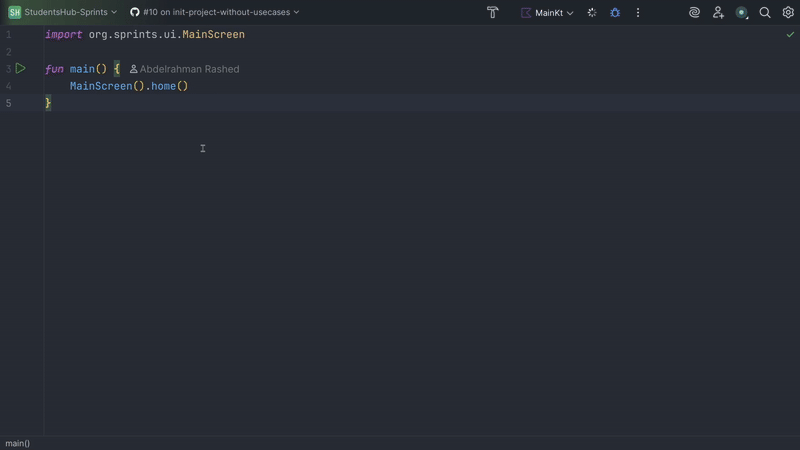
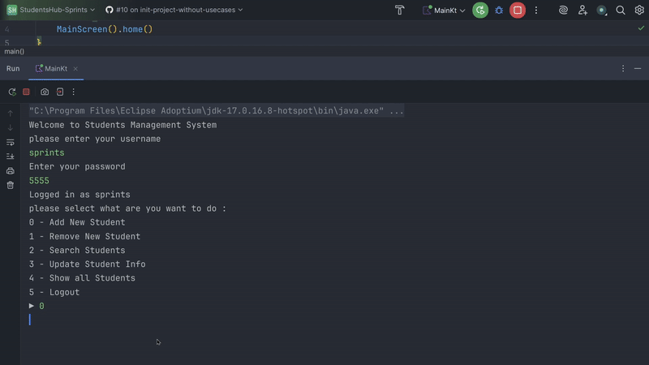
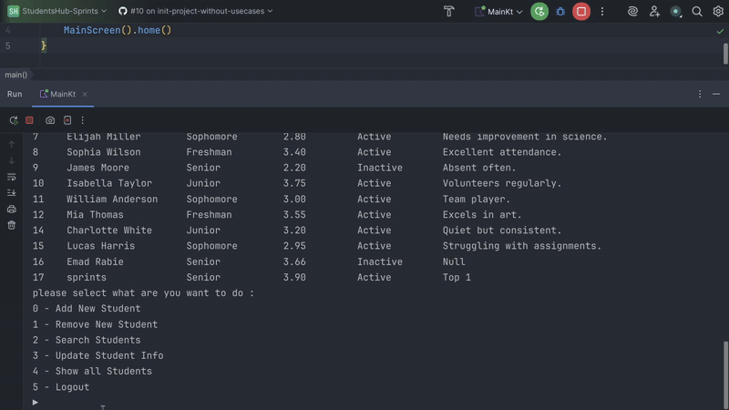
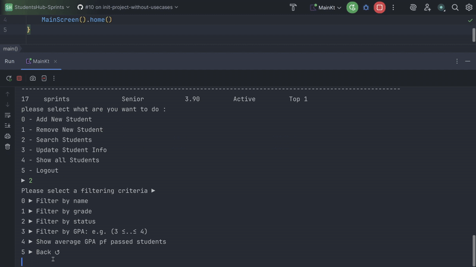
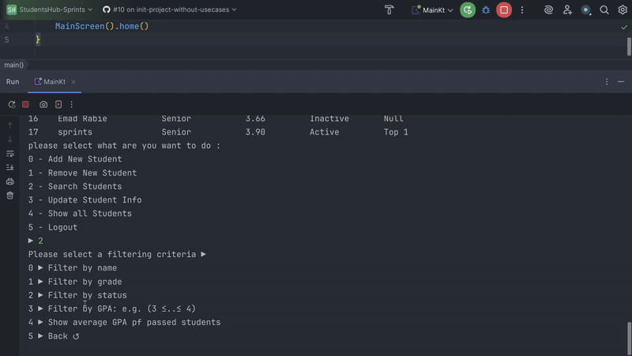
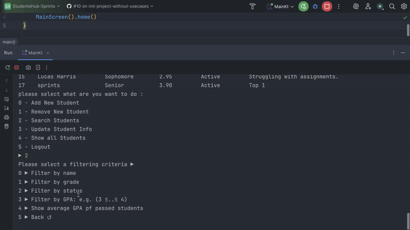
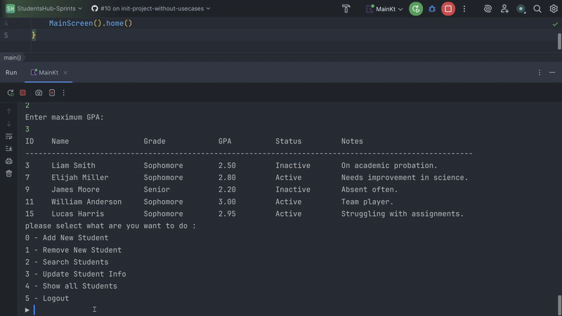
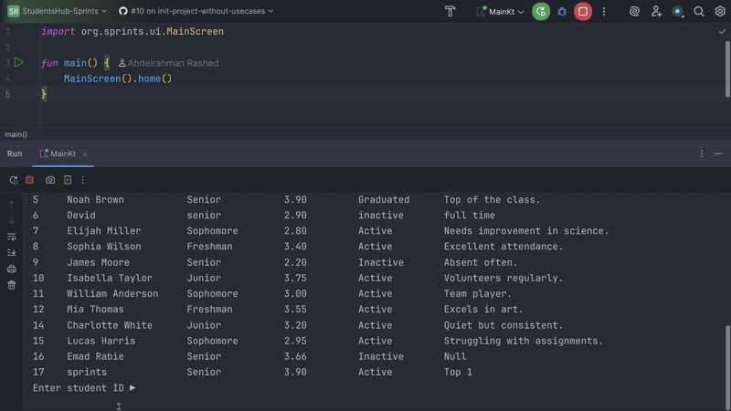

# StudentsHub-Sprints

StudentsHub-Sprints is a console-based student management system built with Kotlin and Gradle. It allows users to manage student records, including adding, removing, updating, and filtering students based on criteria such as name, grade, status, or GPA range. Additionally, it can calculate the average GPA of students who have passed (GPA ≥ 2.0).

## Features

- **Add New Student**: Create a new student record with details like ID, name, grade, status, GPA, and notes.
- **Remove Student**: Delete a student record by ID.
- **Update Student**: Modify existing student information (name, grade, status, GPA, notes).
- **Filter Students**:
  - By name (partial match, case-insensitive).
  - By grade (e.g., Freshman, Sophomore, Junior, Senior).
  - By status (e.g., Active, Inactive, Graduated).
  - By GPA range (e.g., 3.0 to 4.0).
- **Show Average GPA**: Calculate the average GPA of passed students (with a GPA ≥ 2.0).
- **View All Students**: Display a formatted table of all student records.
- **Login System**: Basic authentication (username/password, implementation pending).

## Project Structure

```
StudentsHub-Sprints/
├── src/
│   ├── main/
│   │   ├── kotlin/
│   │   │   ├── org/sprints/data/repository/
│   │   │   │   ├── StudentsRepository.kt
│   │   │   │   ├── UsersRepository.kt
│   │   │   ├── org/sprints/data/storage/
│   │   │   │   ├── StudentStorage.kt
│   │   │   │   ├── UserStorage.kt
│   │   │   ├── org/sprints/domain/models/
│   │   │   │   ├── Student.kt
│   │   │   │   ├── User.kt
│   │   │   ├── org/sprints/domain/repository/
│   │   │   │   ├── StudentsRepository.kt
│   │   │   │   ├── UsersRepository.kt
│   │   │   ├── org/sprints/domain/usecases/
│   │   │   │   ├── AddNewStudentUseCase.kt
│   │   │   │   ├── DeleteStudentUseCase.kt
│   │   │   │   ├── FilterStudentsUseCase.kt
│   │   │   │   ├── GetAllStudentsUseCase.kt
│   │   │   │   ├── LoginUseCase.kt
│   │   │   │   ├── SignupUseCase.kt
│   │   │   │   ├── UpdateStudentInfoUseCase.kt
│   │   │   ├── org/sprints/ui/
│   │   │   │   ├── MainScreen.kt
│   │   │   │   ├── Options.kt
│   │   │   ├── org/sprints/
│   │   │   │   ├── Main.kt
│   └── test/
│       ├── kotlin/
│           ├── (Test files, currently empty)
├── build.gradle.kts
├── settings.gradle.kts
├── README.md
```


# Demo

## SignUp 


## Add New Student 


## Filtering
### FilterByName

### FilterByGrade

### FilterByStatus

### GPA range

### AVG GPA

### RemoveStudent & GetAll

### Update



- **data/repository/**: Contains repository implementations (`StudentsRepository`, `UsersRepository`).
- **domain/models/**: Data classes (e.g., `Student`).
- **domain/repository/**: Repository interfaces (e.g., `StudentsRepository`).
- **domain/usecases/**: Business logic for operations like filtering, updating, and retrieving students.
- **ui/**: Console-based UI (`MainScreen`).

## Prerequisites

- **Java 17 (Eclipse Temurin)**: Required for building and running the project.
- **Gradle 8.10**: Build tool (included via Gradle Wrapper).
- **Kotlin 2.0.20**: For compiling Kotlin code.
- **IDE (Optional)**: IntelliJ IDEA or Eclipse with Kotlin plugin for development.

## Setup Instructions

### 1. Install Eclipse Temurin JDK 17
The project uses a Gradle toolchain configured for Eclipse Temurin JDK 17.

1. **Download JDK**:
   - Visit [Eclipse Adoptium](https://adoptium.net/temurin/releases/?version=17).
   - Download JDK 17 for Windows x64 (e.g., `OpenJDK17U-jdk_x64_windows_hotspot_17.0.12_7.msi`).
   - Install to a directory (e.g., `C:\Program Files\Eclipse Adoptium\jdk-17.0.12+7`).

2. **Set JAVA_HOME**:
   - Open **System Properties**:
     - Right-click **This PC** > **Properties** > **Advanced system settings** > **Environment Variables**.
   - Add/Edit under **System Variables**:
     - Variable name: `JAVA_HOME`
     - Variable value: `C:\Program Files\Eclipse Adoptium\jdk-17.0.12+7` (adjust to your path).
   - Add `%JAVA_HOME%\bin` to the **Path** variable.
   - Verify:
     ```cmd
     java -version
     javac -version
     ```
     Expected output:
     ```
     openjdk version "17.0.12" 2024-07-16
     OpenJDK Runtime Environment Temurin-17.0.12+7 (build 17.0.12+7)
     javac 17.0.12
     ```

### 2. Clone the Repository
```bash
git clone <repository-url>
cd StudentsHub-Sprints
```

### 3. Configure Gradle
The project uses Gradle 8.10 with a toolchain configuration. Ensure `settings.gradle.kts` includes the Foojay resolver for automatic JDK downloads:

```kotlin
plugins {
    id("org.gradle.toolchains.foojay-resolver-convention") version "0.8.0"
}
rootProject.name = "StudentsHub-Sprints"
```

The `build.gradle.kts` is configured as follows:

```kotlin
plugins {
    id("org.jetbrains.kotlin.jvm") version "2.0.20"
    id("org.jetbrains.kotlin.plugin.serialization") version "2.0.20"
}

group = "org.sprints"
version = "1.0-SNAPSHOT"

repositories {
    mavenCentral()
}

dependencies {
    implementation("org.jetbrains.kotlin:kotlin-stdlib")
    implementation("org.jetbrains.kotlinx:kotlinx-serialization-json:1.7.1")
    testImplementation("org.jetbrains.kotlin:kotlin-test")
}

tasks.withType<org.jetbrains.kotlin.gradle.tasks.KotlinCompile>().configureEach {
    kotlinOptions {
        jvmTarget = "17"
    }
}

java {
    toolchain {
        languageVersion.set(JavaLanguageVersion.of(17))
        vendor.set(JvmVendorSpec.ADOPTIUM)
    }
}

tasks.register<JavaExec>("run") {
    group = "application"
    mainClass.set("org.sprints.ui.MainScreen")
    classpath = sourceSets.main.get().runtimeClasspath
}
```

### 4. Build the Project
```bash
gradlew clean build
```

If you encounter a JDK-related error, verify `JAVA_HOME` or ensure the Foojay resolver is configured.

### 5. Run the Application
```bash
gradlew run
```

Alternatively, in an IDE:
- Import the project as a Gradle project.
- Create a run configuration for `org.sprints.ui.MainScreen` with JDK 17.

## Usage

1. **Login**:
   - Enter a username and password (authentication logic is pending implementation).
   - You have 3 attempts before the program exits.

2. **Main Menu**:
   ```
   Welcome to Students Management System
   Please select what you want to do:
   0 - Add New Student
   1 - Remove Student
   2 - Search Students
   3 - Update Student Info
   4 - Show all Students
   5 - Exit
   ```
   - Select an option by entering a number (0–5).

3. **Search Students Menu**:
   ```
   Please select what you want to do:
   0 - Filter by name
   1 - Filter by grade
   2 - Filter by status
   3 - Filter by GPA: e.g. (3 ≤..≤ 4)
   4 - Show average GPA of passed students
   5 - Back
   ```
   - **Filter by Name**: Enter a partial name (e.g., "Michael" to find "Michael Jackson").
   - **Filter by Grade**: Enter a grade (e.g., "Junior").
   - **Filter by Status**: Enter a status (e.g., "Active").
   - **Filter by GPA**: Enter a minimum and maximum GPA (e.g., 3.0 to 4.0).
   - **Show Average GPA**: Displays the average GPA of students with GPA ≥ 2.0 (e.g., 3.28 for sample data).
   - **Back**: Returns to the main menu.

4. **Sample Output** (Show Average GPA):
   ```
   Average GPA of passed students: 3.28
   ```

## Notes
- **Incomplete Features**:
  - `addNewStudent`, `removeStudents`, and `LoginUseCase` are partially implemented. Contributions to complete these are welcome.
  - The `UsersRepository` for authentication is not implemented.
- **Serialization**: The project includes `kotlinx-serialization-json` but does not yet use it. Future enhancements may include saving/loading student data to/from JSON files.
- **Passing Criteria**: A student is considered "passed" if their GPA is ≥ 2.0. Modify `FilterStudentsUseCase.getAverageGPAOfPassedStudents` if a different criterion is needed.

## Troubleshooting

- **Build Failure (JDK Not Found)**:
  - Ensure `JAVA_HOME` is set to a valid Eclipse Temurin JDK 17 path.
  - Verify the Foojay resolver is in `settings.gradle.kts`.
  - Run `gradlew javaToolchains` to check detected JDKs.
- **Deprecated Gradle Features**:
  - Run `gradlew build --warning-mode all` to identify deprecated APIs.
  - Update dependencies or configurations as needed.
- **Clear Gradle Cache**:
  ```bash
  gradlew cleanBuildCache
  rm -rf ~/.gradle/caches
  ```

## Contributing
Contributions are welcome! To contribute:
1. Fork the repository.
2. Create a feature branch (`git checkout -b feature-name`).
3. Commit changes (`git commit -m "Add feature"`).
4. Push to the branch (`git push origin feature-name`).
5. Open a pull request.

## License
This project is licensed under the MIT License.
